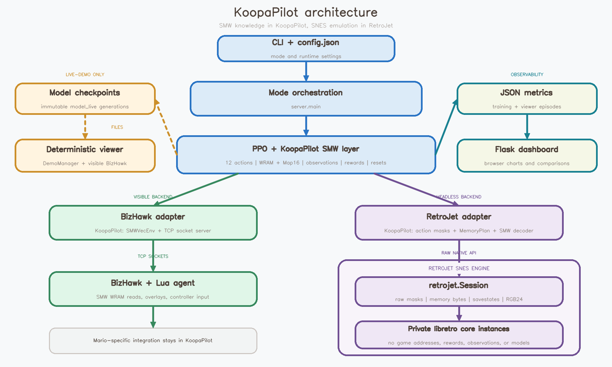

<p align="center">
  
</p>

<h1 align="center">KoopaPilot</h1>

<p align="center">
  A reinforcement learning project that teaches a PPO policy to play <em>Super Mario World</em> through BizHawk/Lua or the headless RetroJet libretro backend.
</p>

<p align="center">
  
  
  
  <a href="LICENSE"></a>
</p>

## About the Project

I have been passionate about _Super Mario World_ for a long time and have been active in the SMW scene since 2014. Over the years, I have contributed to and organized countless SMW-related projects. Eventually, I wanted to explore the game from a different angle: build a detailed reinforcement learning environment and teach Mario to play levels through training.

This repository is the result. It can connect one or more BizHawk emulator instances to a Python server, or use the headless RetroJet backend for faster rollout collection. In both cases it reads the current game state from WRAM, converts it into normalized observations, selects controller inputs with a PPO policy, and tracks training progress in a live dashboard.

## Preview

<p align="center">
  
</p>

| Emulator View | Dashboard |
| --- | --- |
|  |  |

## Features

- Parallel training with configurable BizHawk instances
- TCP communication between BizHawk Lua scripts and the Python server
- Headless RetroJet backend for faster libretro/Snes9x rollout collection
- Savestate-based resets and optional level warping
- PPO training with checkpointing, frame stacking, and resume support
- Tile-grid, sprite, movement, and player-state observations
- Reward shaping for progress, goals, coins, powerups, pipes, doors, enemies, deaths, and inactivity
- Evaluation mode with visible overlays and MP4 recording
- Demo mode for watching a saved model play in visible BizHawk at 100% speed
- Live-demo mode for RetroJet training with one separate visible BizHawk viewer
- Human-play mode for checking reward behavior manually
- Flask dashboard for live metrics and run comparisons

## Architecture

<p align="center">
  
</p>

KoopaPilot's BizHawk and RetroJet adapters implement the same environment
contract: normalized observations, 12 controller actions, and shared reward
logic. BizHawk favors visibility and debugging; the SNES-focused RetroJet
engine supplies high-throughput headless emulation beneath KoopaPilot's SMW
adapter.

## Requirements

- Windows 10 or Windows 11
- Python 3.10 or newer
- [uv](https://docs.astral.sh/uv/getting-started/installation/)
- [BizHawk](https://tasvideos.org/BizHawk) with a SNES-compatible core
- Your own legally obtained _Super Mario World_ ROM
- For the configured default RetroJet backend: Rust, Cargo, and the separate
  `RetroJet` repository. BizHawk-only runs can skip these.

BizHawk binaries and ROM files are intentionally not included in this repository.

## Setup

1. Clone the repository and enter the project directory.

   ```powershell
   git clone https://github.com/Xamexer/KoopaPilot.git
   cd KoopaPilot
   ```

2. Install the Python environment and locked dependencies.

   ```powershell
   uv sync --locked
   ```

3. Download a current BizHawk release from the [official release page](https://github.com/TASEmulators/BizHawk/releases) and extract it locally. The default configuration expects:

   ```text
   ./BizHawk/EmuHawk.exe
   ```

4. Place your own ROM at:

   ```text
   ./roms/Super Mario World.sfc
   ```

5. Optional: if you prefer savestate resets, create one or more BizHawk
   savestates and place the `.State` files in:

   ```text
   ./savestates/
   ```

6. Review `config.json`, especially the paths, backend, emulator count, ports, level IDs, reward values, and PPO hyperparameters.

`uv` creates and manages the local `.venv` automatically. Dependencies are declared in `pyproject.toml`; exact resolved versions live in `uv.lock`.

## RetroJet Setup

RetroJet is a separate repository that should live next to KoopaPilot:

```text
parent-directory/
|-- KoopaPilot/
`-- RetroJet/
```

The supplied `config.json` selects RetroJet for normal training. Complete this
section before using the bare `uv run koopapilot` command, or select the
self-contained BizHawk backend explicitly with `--backend bizhawk`.

Build RetroJet:

```powershell
cd ../RetroJet
uv sync --extra dev
.\scripts\download_cores.ps1
$env:CONDA_PREFIX=$null
uv run maturin develop --release
```

Install RetroJet into KoopaPilot's environment:

```powershell
cd ../KoopaPilot
$env:CONDA_PREFIX=$null
uv pip install -e ../RetroJet
```

KoopaPilot uses the single ROM configured by `paths.rom` for both backends;
the default remains `./roms/Super Mario World.sfc`.

RetroJet provides the SNES/libretro runtime. KoopaPilot owns the SMW action
table, WRAM capture plan, state decoder, level initialization, observations,
and rewards; the native engine receives only raw controller masks and memory
ranges.

Quick RetroJet benchmark:

```powershell
cd ../RetroJet
uv run retrojet-benchmark --core ./cores/snes9x2010_libretro.dll --content "../KoopaPilot/roms/Super Mario World.sfc" --envs 16 --threads 4 --frames 1200 --frame-skip 4
```

Run the benchmark on your own machine to choose a suitable `num_envs` value.

## Creating Savestates

Savestates make episode resets reliable and allow training on selected levels.

1. Open the ROM in BizHawk.
2. Navigate to the desired starting position.
3. Save a named state through BizHawk.
4. Copy the resulting `.State` file into `./savestates/`.
5. Repeat this for each training start you want to sample.

When `level_loading.savestate_files` is empty, the BizHawk backend scans the
top level of `./savestates/`. RetroJet only loads paths listed explicitly; a
non-empty list takes priority over `level_loading.levels`.

For full ROM-backed resets instead of savestates, use quoted hexadecimal
Lunar Magic level IDs:

```json
"level_loading": {
  "mode": "level_loading",
  "levels": ["0x105", "0x106"],
  "savestate_files": []
}
```

This starts SMW's real overworld-to-level game-mode sequence, so level
headers, Map16, graphics, music, and sprites are loaded again after every
episode reset or registered death. Select only first rooms that can be
entered from the overworld (`0x001`-`0x024` or `0x101`-`0x1DB`), not
sublevels that are reachable only through doors or pipes.

## Running KoopaPilot

Run commands from the KoopaPilot project directory. Training is the default
mode. During regular training and demo modes, the dashboard is available at
[http://127.0.0.1:8080](http://127.0.0.1:8080).

| Goal | Command |
| --- | --- |
| Train with the configured backend (RetroJet by default) | `uv run koopapilot` |
| Continue training from a checkpoint | `uv run koopapilot --model ./models/model_best.zip` |
| Train with visible BizHawk instances and overlays | `uv run koopapilot --backend bizhawk --vis` |
| Train in RetroJet while watching one live BizHawk viewer | `uv run koopapilot --mode live-demo` |
| Watch a checkpoint without training | `uv run koopapilot --mode demo --model ./models/model_best.zip` |
| Evaluate five visible episodes and record video | `uv run koopapilot --mode evaluation --model ./models/model_best.zip --episodes 5` |
| Export one deterministic Snes9x episode directly to MP4 | `uv run koopapilot --mode retrojet-evaluation --model ./models/model_best.zip --episodes 1 --level 0x105 --no-realtime` |
| Play manually and inspect reward events | `uv run koopapilot --mode human` |
| Run only the dashboard | `uv run koopapilot --mode dashboard` |

## Configuration

All runtime settings live in `config.json`.

| Section           | Purpose                                                                        |
| ----------------- | ------------------------------------------------------------------------------ |
| `paths`           | Local BizHawk, ROM, Lua script, savestate, model, log, and video paths         |
| `emulator`        | Instance count, socket ports, speed, frame skip, sound, and window layout      |
| `backend`         | Backend selection plus settings unique to `bizhawk` or `retrojet`              |
| `live_demo`       | Refresh interval for the temporary visible-viewer model mirror                 |
| `flags`           | Tile, reward, and controller overlay visibility                                |
| `level_loading`   | Savestate scanning, explicit state files, or Lunar Magic level IDs for warping |
| `ram_addresses`   | WRAM addresses used as a readable reference for the integration                |
| `tile_categories` | Numeric labels used for Map16 tile classes                                     |
| `normalization`   | Screen dimensions, tile-grid size, and normalization constants                 |
| `rewards`         | Reward weights, penalties, teleport threshold, and inactivity handling         |
| `ppo`             | PPO hyperparameters, frame stack, checkpoints, and episode limits              |
| `performance`     | Host-specific CPU runtime tuning                                                 |
| `dashboard`       | Dashboard bind host, port, and refresh interval                                |

Important variables:

| Variable                       | Default   | Notes                                                     |
| ------------------------------ | --------- | --------------------------------------------------------- |
| `paths.rom`                    | `./roms/Super Mario World.sfc` | One ROM shared by BizHawk and RetroJet       |
| `emulator.num_instances`       | `8`       | Number of parallel BizHawk processes                      |
| `emulator.frame_skip`          | `4`       | One shared action-repeat value for both backends          |
| `backend.type`                 | `retrojet` | Default training backend; use `bizhawk` for Lua/socket training |
| `backend.retrojet.num_envs`    | `16`      | Number of headless RetroJet environments                  |
| `backend.retrojet.core_path`   | `../RetroJet/cores/snes9x2010_libretro.dll` | Libretro core used by RetroJet       |
| `level_loading.levels`         | `["0x105", "0x106"]` | One level list shared by both backends         |
| `live_demo.save_interval_steps` | `10000`  | How often a new immutable live-viewer model generation is published |
| `performance.torch_threads`      | `4`      | Conservative PyTorch CPU worker limit                              |
| `performance.retrojet_threads`   | `4`      | Hard limit for RetroJet's native Rayon worker pool                  |
| `emulator.base_port`           | `9000`    | First TCP port; following instances use consecutive ports |
| `emulator.speed_percent`       | `6400`    | BizHawk speed during training                             |
| demo speed                     | `100`     | Demo and live-demo BizHawk instances always run normally  |
| `normalization.grid_size`      | `21`      | Odd-sized tile grid centered around Mario                 |
| `normalization.max_sprite_hitbox_dimension` | `128` | Scale reserved for normalized sprite footprint dimensions |
| `ppo.frame_stack`              | `4`       | Consecutive observation frames exposed to PPO             |
| `ppo.verbose`                  | `0`       | Keep PPO rollout tables out of the console                 |
| `ppo.n_steps`                  | `128`     | Steps collected per emulator before each PPO update       |
| `ppo.batch_size`               | `512`     | Minibatch size; four minibatches per default RetroJet rollout |
| `ppo.gamma`                    | `0.99`    | Reward discount factor                                    |
| `ppo.gae_lambda`               | `0.95`    | Bias-variance tradeoff for advantage estimation           |
| `ppo.clip_range`               | `0.1`     | Linearly decaying PPO policy-update clip range             |
| `ppo.ent_coef`                 | `0.01`    | Entropy bonus coefficient for exploration                 |
| `ppo.target_kl`                | `0.03`    | Safety stop for unusually large PPO updates               |
| `ppo.total_timesteps`          | `25000000` | Total training budget                                    |
| `ppo.save_interval_steps`      | `100000`  | Checkpoint interval                                       |
| `ppo.max_episode_steps`        | `1024`    | Hard episode limit                                        |
| `ppo.stagnation_timeout_steps` | `300`     | Stop episodes that make no progress                       |

The BizHawk Lua integration and KoopaPilot's RetroJet SMW decoder contain the
active Map16 classification logic. If tile categories are extended or
remapped, keep `config.json`, `lua/smw_agent.lua`, and
`server/games/smw/memory.py` aligned.

## Observation Space

With the default `21 x 21` tile grid, one observation contains `562` values before frame stacking:

| Component             | Size | Description                                                        |
| --------------------- | ---: | ------------------------------------------------------------------ |
| Mario screen position |    2 | Normalized X/Y coordinates                                         |
| Mario velocity        |    2 | Signed normalized X/Y speed                                        |
| Powerup state         |    4 | One-hot small, big, cape, or fire state                            |
| Movement state        |    4 | One-hot ground, air, water, or climbing state                      |
| Level orientation     |    1 | Horizontal or vertical level flag                                  |
| Tile grid             |  441 | `21 x 21` normalized Map16 categories                              |
| Sprites               |  108 | 12 slots with active state, ID, position, native or platform-specific interaction footprint, velocity, and misc state |

With the default four-frame stack, PPO receives `2248` values per environment step.

Native sprite footprints replaced RetroJet's earlier fixed 16 x 16 boxes. The
tensor shape is unchanged, but some values differ; re-evaluate checkpoints made
with older RetroJet builds and retrain when strictly comparable results matter.

## Action Space

The policy selects one of 12 discrete controller combinations. The action table covers idle, left/right running, jumps, spin jumps, ducking, door or climbing input, and releasing `Y`. Run is held by default so that movement stays responsive at training speed.

## Reward Design

Reward weights are configured in `config.json`. There is no universal set of
values: suitable weights depend on the level, action space, episode length,
and training goal, so each project should evaluate and tune them independently.

Horizontal progress is rewarded only at new per-episode maximum X positions.
Vertical progress works in every level and is rewarded only when Mario reaches
a new highest point. Returning to an old position or repeatedly jumping to the
same height therefore cannot farm progress reward. Large coordinate jumps are
treated as teleports to prevent savestate loads and transitions from creating
false progress.

`exploration_new_cell` can optionally reward a coarse position once per
episode. When enabled, new cells also reset the stagnation timeout without
making back-and-forth movement farmable. Goals, items, enemies, damage, death,
and time can be weighted independently in the same configuration section.

## Training Profile

The default RetroJet profile uses `128` steps across 16 headless environments,
producing `2048` transitions per update. With a minibatch size of `512`, PPO
trains on four minibatches for each of four epochs. BizHawk keeps a smaller
default of eight visible processes while using the same frame skip.

Observation assembly uses a preallocated NumPy vector because it runs once per
environment step. The two settings below `performance` independently cap PPO
and RetroJet CPU parallelism. The conservative default of four workers each is
intended for stable long-running training rather than maximum benchmark speed.
Increase them only while monitoring CPU temperature and system stability.
These limits do not change checkpoint shapes or observation values.

Timeouts and maximum-step limits are treated as truncated episodes. Deaths
and goals remain real terminal states. This distinction allows the value
function to bootstrap correctly when an episode ends only because of a
configured time limit.

## Dashboard

Training runs write JSON metrics below `./logs/`. The Flask dashboard can:

- display timesteps, episodes, goal rate, rewards, and horizontal progress;
- distinguish stochastic training rollouts from deterministic live-demo episodes;
- plot reward, episode length, and episode maximum X over time;
- load the latest run automatically;
- inspect a previous run;
- compare reward graphs across multiple runs.

## Project Structure

```text
.
|-- config.json
|-- pyproject.toml
|-- uv.lock
|-- lua/
|   `-- smw_agent.lua
|-- server/
|   |-- main.py
|   |-- demo.py
|   |-- environment.py
|   |-- games/
|   |   `-- smw/
|   |       |-- actions.py
|   |       |-- memory.py
|   |       `-- retrojet_runner.py
|   |-- vec_env.py
|   |-- socket_server.py
|   |-- retrojet_backend.py
|   |-- observation.py
|   |-- reward.py
|   |-- training.py
|   |-- evaluation.py
|   |-- human_play.py
|   |-- emulator_manager.py
|   |-- metrics.py
|   `-- dashboard/
|-- docs/images/
|-- models/       # local checkpoints, ignored by Git
|-- logs/         # local training metrics, ignored by Git
|-- roms/         # local ROM files, ignored by Git
|-- savestates/   # local BizHawk states, ignored by Git
`-- videos/       # local evaluation recordings, ignored by Git
```

## RAM Map References

The WRAM addresses used by this project were researched with the SMWCentral documentation:

- [SMWCentral SMW RAM Memory Map](https://www.smwcentral.net/?p=memorymap&game=smw&region=ram)

Useful related references:

- [BizHawk project page](https://tasvideos.org/BizHawk)
- [BizHawk releases](https://github.com/TASEmulators/BizHawk/releases)
- [Stable-Baselines3 PPO documentation](https://stable-baselines3.readthedocs.io/en/master/modules/ppo.html)

## Legal Notice

This is an independent research and hobby project. It is not affiliated with or endorsed by Nintendo. No ROM, commercial game data, BizHawk binaries, savestates, or trained checkpoints are distributed through this repository.

## License

Released under the [MIT License](LICENSE).
