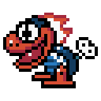
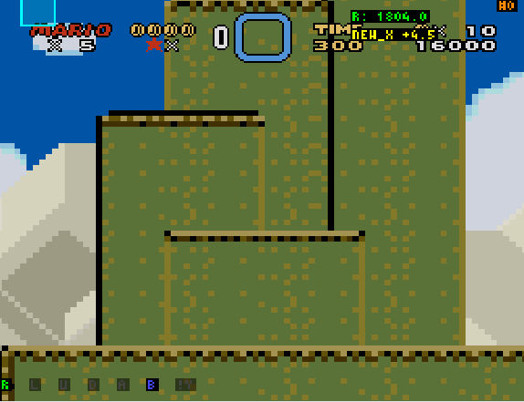
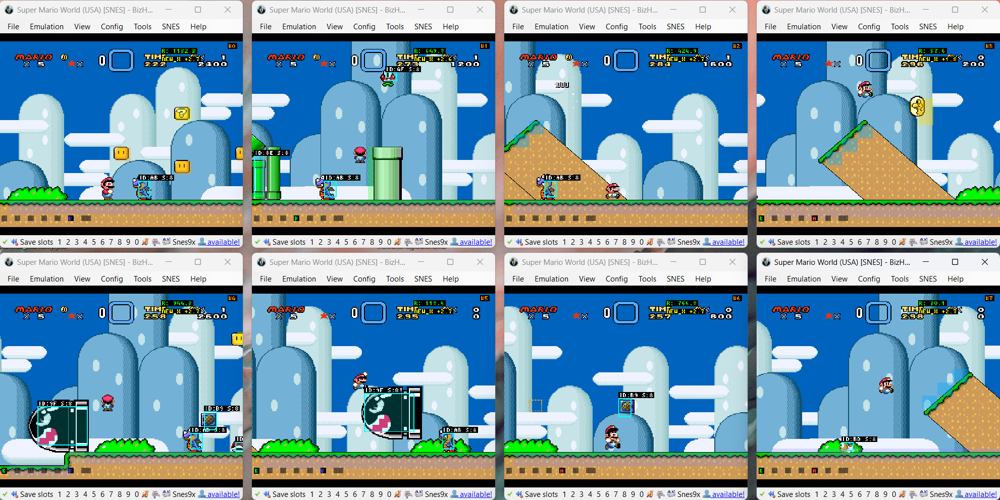
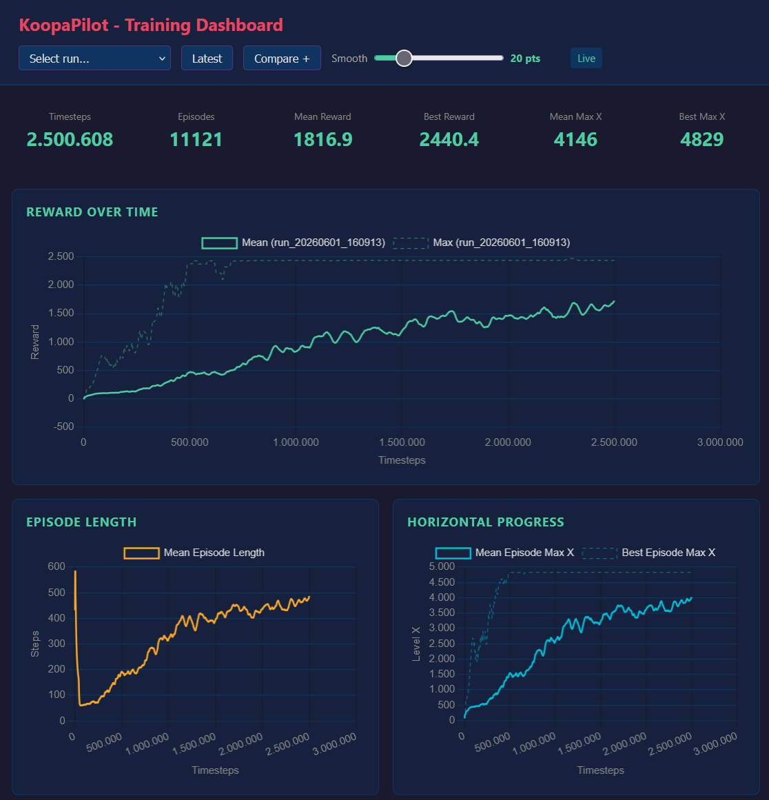

<p align="center">
  
</p>

<h1 align="center">KoopaPilot</h1>

<p align="center">
  A reinforcement learning project that teaches a PPO policy to play <em>Super Mario World</em> through BizHawk, Lua scripting, and a Python training server.
</p>

## About the Project

I have been passionate about _Super Mario World_ for a long time and have been active in the SMW scene since 2014. Over the years, I have contributed to and organized countless SMW-related projects. Eventually, I wanted to explore the game from a different angle: build a detailed reinforcement learning environment and teach Mario to play levels through training.

This repository is the result. It connects one or more BizHawk emulator instances to a Python server, reads the current game state from WRAM, converts it into normalized observations, selects controller inputs with a PPO policy, and tracks training progress in a live dashboard.

## Preview

<p align="center">
  
</p>

### Emulator View



### Dashboard



## Features

- Parallel training with configurable BizHawk instances
- TCP communication between BizHawk Lua scripts and the Python server
- Savestate-based resets and optional level warping
- PPO training with checkpointing, frame stacking, and resume support
- Tile-grid, sprite, movement, and player-state observations
- Reward shaping for progress, goals, coins, powerups, pipes, doors, enemies, deaths, and inactivity
- Evaluation mode with visible overlays and MP4 recording
- Human-play mode for checking reward behavior manually
- Flask dashboard for live metrics and run comparisons

## Architecture

```text
Python PPO training server
    |
    +-- Gymnasium environment and vectorized wrapper
    +-- observation builder and reward calculator
    +-- metrics logger and Flask dashboard
    |
    +-- TCP sockets, one port per emulator
            |
            +-- BizHawk + lua/smw_agent.lua
                    |
                    +-- WRAM reads
                    +-- controller input
                    +-- savestate resets
                    +-- overlays and screenshots
```

## Requirements

- Windows 10 or Windows 11
- Python 3.10 or newer
- [uv](https://docs.astral.sh/uv/getting-started/installation/)
- [BizHawk](https://tasvideos.org/BizHawk) with a SNES-compatible core
- Your own legally obtained _Super Mario World_ ROM

BizHawk binaries and ROM files are intentionally not included in this repository.

## Setup

1. Clone the repository and enter the project directory.

   ```powershell
   git clone <your-repository-url>
   cd KoopaPilot
   ```

2. Install the Python environment and locked dependencies.

   ```powershell
   uv sync --locked
   ```

3. Download a current BizHawk release from the [official release page](https://github.com/TASEmulators/BizHawk/releases) and extract it locally. The default configuration expects:

   ```text
   ./BizHawk/EmuHawk.exe
   ```

4. Place your own ROM at:

   ```text
   ./roms/Super Mario World.sfc
   ```

5. Create one or more BizHawk savestates and place the `.State` files in:

   ```text
   ./savestates/
   ```

6. Review `config.json`, especially the paths, emulator count, ports, savestate settings, reward values, and PPO hyperparameters.

`uv` creates and manages the local `.venv` automatically. Dependencies are declared in `pyproject.toml`; exact resolved versions live in `uv.lock`.

## Creating Savestates

Savestates make episode resets reliable and allow training on selected levels.

1. Open the ROM in BizHawk.
2. Navigate to the desired starting position.
3. Save a named state through BizHawk.
4. Copy the resulting `.State` file into `./savestates/`.
5. Repeat this for each training start you want to sample.

When `level_loading.savestate_files` is empty, the server automatically scans the top level of `./savestates/`.

## Commands

Start a fresh training run:

```powershell
uv run koopapilot --mode training
```

Show the colored tile grid and sprite markers during training:

```powershell
uv run koopapilot --mode training --vis
```

Resume training from a checkpoint:

```powershell
uv run koopapilot --mode training --model ./models/model_best.zip
```

Checkpoints require the same observation-space, action-space, and PPO rollout
settings that were used when they were created.

Evaluate a trained model with visible overlays and video recording:

```powershell
uv run koopapilot --mode evaluation --model ./models/model_best.zip
```

Evaluate a fixed number of episodes:

```powershell
uv run koopapilot --mode evaluation --model ./models/model_best.zip --episodes 5
```

Play manually while inspecting reward events:

```powershell
uv run koopapilot --mode human
```

Run only the metrics dashboard:

```powershell
uv run koopapilot --mode dashboard
```

Connect to emulator instances that are already running:

```powershell
uv run koopapilot --mode training --no-launch
```

Use another configuration file:

```powershell
uv run koopapilot --mode training --config ./my_config.json
```

Show all CLI options:

```powershell
uv run koopapilot --help
```

The dashboard is available at [http://127.0.0.1:8080](http://127.0.0.1:8080) by default.

## Configuration

All runtime settings live in `config.json`.

| Section           | Purpose                                                                        |
| ----------------- | ------------------------------------------------------------------------------ |
| `paths`           | Local BizHawk, ROM, Lua script, savestate, model, log, and video paths         |
| `emulator`        | Instance count, socket ports, speed, frame skip, sound, and window layout      |
| `flags`           | Tile, reward, and controller overlay visibility                                |
| `level_loading`   | Savestate scanning, explicit state files, or Lunar Magic level IDs for warping |
| `ram_addresses`   | WRAM addresses used as a readable reference for the integration                |
| `tile_categories` | Numeric labels used for Map16 tile classes                                     |
| `normalization`   | Screen dimensions, tile-grid size, and normalization constants                 |
| `rewards`         | Reward weights, penalties, teleport threshold, and inactivity handling         |
| `ppo`             | PPO hyperparameters, frame stack, checkpoints, and episode limits              |
| `dashboard`       | Dashboard bind host, port, and refresh interval                                |

Important variables:

| Variable                       | Default   | Notes                                                     |
| ------------------------------ | --------- | --------------------------------------------------------- |
| `emulator.num_instances`       | `8`       | Number of parallel BizHawk processes                      |
| `emulator.base_port`           | `9000`    | First TCP port; following instances use consecutive ports |
| `emulator.speed_percent`       | `6400`    | BizHawk speed during training                             |
| `emulator.frame_skip`          | `4`       | Frames repeated for each selected action                  |
| `normalization.grid_size`      | `21`      | Odd-sized tile grid centered around Mario                 |
| `normalization.max_sprite_hitbox_dimension` | `128` | Scale reserved for normalized sprite footprint dimensions |
| `ppo.frame_stack`              | `4`       | Consecutive observation frames exposed to PPO             |
| `ppo.n_steps`                  | `128`     | Steps collected per emulator before each PPO update       |
| `ppo.batch_size`               | `256`     | Minibatch size; four minibatches per update with 8 emulators |
| `ppo.gamma`                    | `0.99`    | Reward discount factor                                    |
| `ppo.gae_lambda`               | `0.95`    | Bias-variance tradeoff for advantage estimation           |
| `ppo.clip_range`               | `0.1`     | Linearly decaying PPO policy-update clip range             |
| `ppo.ent_coef`                 | `0.01`    | Entropy bonus coefficient for exploration                 |
| `ppo.target_kl`                | `0.03`    | Safety stop for unusually large PPO updates               |
| `ppo.total_timesteps`          | `2500000` | Total training budget                                     |
| `ppo.save_interval_steps`      | `100000`  | Checkpoint interval                                       |
| `ppo.max_episode_steps`        | `1024`    | Hard episode limit                                        |
| `ppo.stagnation_timeout_steps` | `300`     | Stop episodes that make no progress                       |

The Lua integration contains the active Map16 classification logic. If tile categories are extended or remapped, keep `config.json` and `lua/smw_agent.lua` aligned.

## Observation Space

With the default `21 x 21` tile grid, one observation contains `562` values before frame stacking:

| Component             | Size | Description                                                        |
| --------------------- | ---: | ------------------------------------------------------------------ |
| Mario screen position |    2 | Normalized X/Y coordinates                                         |
| Mario velocity        |    2 | Signed normalized X/Y speed                                        |
| Powerup state         |    4 | One-hot small, big, cape, or fire state                            |
| Movement state        |    4 | One-hot ground, air, water, or climbing state                      |
| Level orientation     |    1 | Horizontal or vertical level flag                                  |
| Tile grid             |  441 | `21 x 21` normalized Map16 categories                              |
| Sprites               |  108 | 12 slots with active state, ID, position, stable default footprint, velocity, and misc state |

With the default four-frame stack, PPO receives `2248` values per environment step.

## Action Space

The policy selects one of 12 discrete controller combinations. The action table covers idle, left/right running, jumps, spin jumps, ducking, door or climbing input, and releasing `Y`. Run is held by default so that movement stays responsive at training speed.

## Reward Design

The reward calculator favors new level progress and successful exits while discouraging deaths, damage, inactivity, and endless episodes.

| Event                                    |    Default reward |
| ---------------------------------------- | ----------------: |
| New horizontal progress                  |  `+0.3` per pixel |
| New vertical progress in vertical levels |  `+0.3` per pixel |
| Goal reached                             |           `+1000` |
| Coin collected                           |              `+0` |
| Powerup upgrade                          |              `+5` |
| 1-UP collected                           |              `+0` |
| Pipe or door transition                  |             `+50` |
| Enemy defeated                           |              `+0` |
| Enemy stunned                            |              `+0` |
| Death                                    |             `-30` |
| Powerup loss                             |             `-10` |
| Time penalty                             |  `-0.01` per step |

Horizontal reward is granted only for new per-episode maximum X positions.
Returning to previously visited ground therefore cannot farm reward. Large
coordinate jumps are treated as teleports to prevent savestate loads and
transitions from creating false progress rewards.

## Training Profile

The default PPO profile uses short rollouts: `128` steps across each of the
eight emulator instances, producing `1024` transitions per update. With a
minibatch size of `256`, PPO trains on four minibatches for each of four
epochs. This keeps policy updates frequent while preserving a useful amount
of parallel experience.

Timeouts and maximum-step limits are treated as truncated episodes. Deaths
and goals remain real terminal states. This distinction allows the value
function to bootstrap correctly when an episode ends only because of a
configured time limit.

## Dashboard

Training runs write JSON metrics below `./logs/`. The Flask dashboard can:

- display timesteps, episodes, rewards, and horizontal progress;
- plot reward, episode length, and episode maximum X over time;
- load the latest run automatically;
- inspect a previous run;
- compare reward graphs across multiple runs.

## Project Structure

```text
.
|-- config.json
|-- pyproject.toml
|-- uv.lock
|-- lua/
|   `-- smw_agent.lua
|-- server/
|   |-- main.py
|   |-- environment.py
|   |-- vec_env.py
|   |-- socket_server.py
|   |-- observation.py
|   |-- reward.py
|   |-- training.py
|   |-- evaluation.py
|   |-- human_play.py
|   |-- emulator_manager.py
|   |-- metrics.py
|   `-- dashboard/
|-- tests/
|-- docs/images/
|-- models/       # local checkpoints, ignored by Git
|-- logs/         # local training metrics, ignored by Git
|-- roms/         # local ROM files, ignored by Git
|-- savestates/   # local BizHawk states, ignored by Git
`-- videos/       # local evaluation recordings, ignored by Git
```

## RAM Map References

The WRAM addresses used by this project were researched with the SMWCentral documentation:

- [SMWCentral SMW RAM Memory Map](https://www.smwcentral.net/?p=memorymap&game=smw&region=ram)
- [SMWCentral legacy RAM Map reference](https://media.smwcentral.net/Iceguy/ram.htm)

Useful related references:

- [BizHawk project page](https://tasvideos.org/BizHawk)
- [BizHawk releases](https://github.com/TASEmulators/BizHawk/releases)
- [Stable-Baselines3 PPO documentation](https://stable-baselines3.readthedocs.io/en/master/modules/ppo.html)

## Tests

Run the lightweight unit suite:

```powershell
uv run python -m unittest discover -s tests -v
```

Run a syntax check:

```powershell
uv run python -m compileall -q server tests
```

Full end-to-end training and evaluation checks require a local BizHawk installation, a ROM, and savestates.

## Legal Notice

This is an independent research and hobby project. It is not affiliated with or endorsed by Nintendo. No ROM, commercial game data, BizHawk binaries, savestates, trained checkpoints, or recorded videos are distributed through this repository.

## License

Released under the [MIT License](LICENSE).
